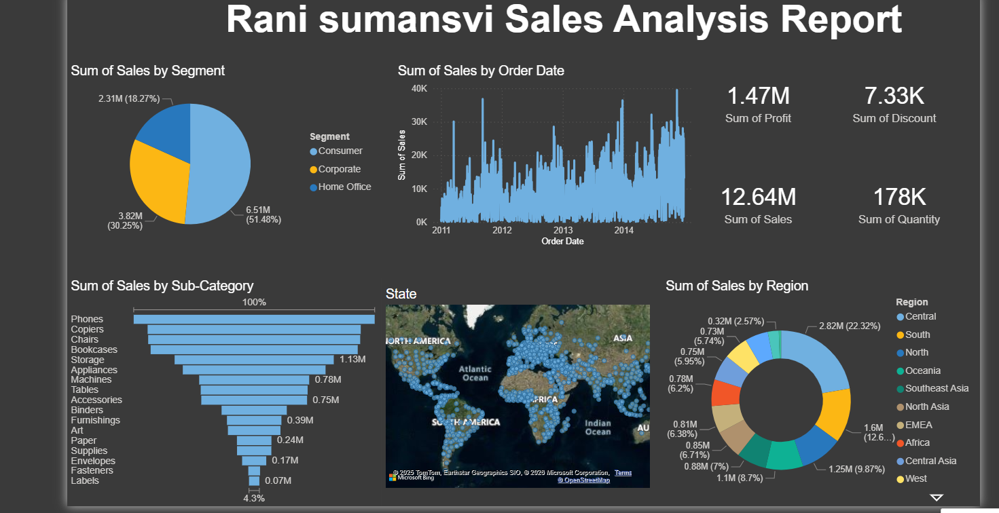

1.Project Title
# Sales Analysis Dashboard using Power BI
2.Project Description
## Project Description
This project is a Sales Analysis Dashboard created using Power BI.
It helps to understand sales performance, profit, quantity, and discounts
across different regions, segments, and product categories.
3.Tools Used
## Tools Used
- Power BI Desktop
- Excel (Dataset)
4.Dataset Information
  ## Dataset Information
The dataset contains sales data including:
- Order Date
- Sales
- Profit
- Quantity
- Discount
- Segment
- Region
- Category and Sub-Category
5.Key Insights
  ## Key Insights
- Total Sales: 12.64M
- Total Profit: 1.47M
- Consumer segment contributes the highest sales
- Phones and Chairs are top-selling sub-categories
- North America and Europe generate major sales
6.Dashboard Features
  ## Dashboard Features
- KPI cards for Sales, Profit, Quantity, and Discount
- Sales trend analysis by Order Date
- Segment-wise and Region-wise sales analysis
- Sub-category performance analysis
- Geographic sales distribution using maps
7.Files in Repository
  ## Files in Repository
- Sales_Analysis_PowerBI.pbix – Power BI dashboard file
- README.md – Project documentation
- dashboard.png – Dashboard screenshot
## Dashboard Preview

